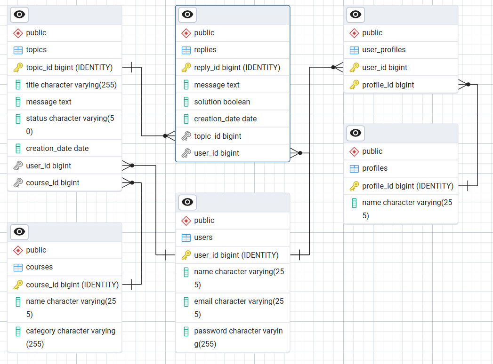

# 🏛️ API Foro Hub

Esta API REST desarrollada en Java con Spring Boot, enviar solicitudes HTTP con autenticación JWT, mediante endpoints.

## ✨ ONE G8

Este proyecto fue creado para completar el challenge ONE G8 Backend - Challenge Foro Hub - Spring Boot.

## 🚀 Características

- Autenticación de usuarios con tokens JWT.
- CRUD de tópicos.
- Manejo de errores
- Registro de respuestas y usuarios.

## 🛠️ Stack Tecnológico

- **Java 21** - Lenguaje principal
- **Spring Boot 3.5.4** - Framework
- **Spring Security** - Autenticación y autorización
- **Spring Data JPA** - Persistencia de datos
- **PostgreSQL** - Base de datos
- **Flyway** - Migraciones de BD
- **Maven** - Gestión de dependencias
- **Lombok** - Reducción de boilerplate

## ⚙️ Requisitos

- Java 21 o superior
- Maven 3.8+
- PostgreSQL 13+

## 🚀 Instalación y Ejecución

### 1. Clonar el repositorio
```bash
git clone https://github.com/YoshuaPariona/challenge-foro-hub.git
cd challenge-foro-hub
```

### 2. Configurar variables de entorno
```
DB_HOST = localhost
DB_PORT = 5432
DB_NAME = forum_database
DB_USER = tu_usuario_postgres
DB_PASSWORD = tu_contraseña_postgres
JWT_SECRET = tu-jwt-para-desarrollo-123456789
```

### 3. Ejecutar la aplicación
```bash
mvn spring-boot:run
```

## 🧱 Arquitectura del Proyecto

```
src\main\java\com\yoshua\api_forum>
│   ApiForumApplication.java
│
├───controller
│       AuthController.java
│       ReplyController.java
│       TopicController.java
│
├───domain
│   ├───course
│   │       Course.java
│   │       CourseRepository.java
│   │
│   ├───profile
│   │       Profile.java
│   │       ProfileRepository.java
│   │
│   ├───reply
│   │       DataDetailReply.java
│   │       DataRegisterReply.java
│   │       Reply.java
│   │       ReplyRepository.java
│   │       ReplyService.java
│   │
│   ├───topic
│   │       DataDetailTopic.java
│   │       DataListTopic.java
│   │       DataRegisterTopic.java
│   │       DataUpdateTopic.java
│   │       Topic.java
│   │       TopicRepository.java
│   │       TopicService.java
│   │
│   └───user
│           AuthData.java
│           AuthService.java
│           User.java
│           UserRepository.java
│
└───infrastructure
    ├───exceptions
    │       ErrorManager.java
    │
    └───security
            SecurityConfigurations.java
            SecurityFilter.java
            TokenJWTData.java
            TokenService.java
```

## 📊 Base de Datos



## 🛡️ Seguridad

- Tokens JWT con expiración
- Bcrypt para hash de passwords

## 📄 Licencia

Este proyecto está licenciado bajo la **Licencia MIT**. Consulta el archivo [LICENSE](LICENSE) para más detalles.